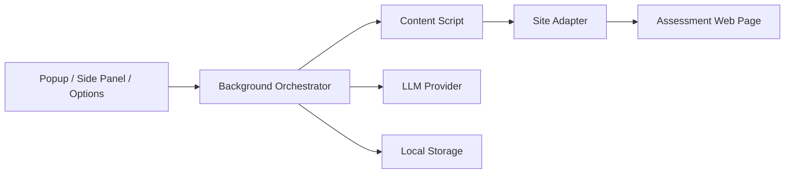

# Software Design Document

## 1. Purpose

This document defines a simplified, implementation-oriented architecture for `ATTI`, an Edge extension that:

- stores user profile data locally,
- analyzes third-party personality assessment pages,
- generates answer recommendations with an LLM,
- previews answers before filling them into the page.

The current design goal is to keep the system modular, local-first, and easy to evolve from the locked single-site MVP into an AI-first multi-site product in small, audited steps.

## 2. Design Principles

- `Local First`: user profile, sessions, and history stay on-device by default.
- `Human In The Loop`: the system may recommend and fill answers, but should not auto-submit by default.
- `AI-First Transition`: future multi-site expansion should favor normalized AI planning and lighter site-specific hard-coding, but the current repository still keeps real extraction and fill inside the locked Truity adapter boundary.
- `Modular By Default`: split code by domain, runtime, and feature.
- `No Monolith`: do not place multiple domains or runtimes in one giant file.
- `Replaceable Providers`: LLM, storage, and site adapters must be swappable.
- `Observable Flows`: every major step should be debuggable.

## 3. Simplified Architecture



## 4. Runtime Boundaries

### 4.1 UI Layer

Responsibilities:

- profile onboarding,
- viewing current page status,
- previewing recommendations,
- exposing the single-site trial fill trigger and related status,
- managing settings and privacy options.

Files should live under:

```text
src/app/popup/
src/app/sidepanel/
src/app/options/
```

### 4.2 Background Layer

Responsibilities:

- session orchestration,
- message routing,
- provider invocation,
- storage coordination,
- permission and risk checks.

Files should live under:

```text
src/background/
```

### 4.3 Content Layer

Responsibilities:

- detecting supported pages,
- extracting DOM-based questions,
- previewing planned answers,
- applying fill operations.

Current implementation note:

- the stable production path is still the Truity-specific adapter flow
- future multi-site expansion may introduce AI-assisted site understanding, but that must not collapse provider, UI, storage, and DOM automation into one runtime boundary

Files should live under:

```text
src/content/
src/adapters/
```

### 4.4 Domain Layer

Responsibilities:

- shared business types,
- profile logic,
- assessment logic,
- automation logic.

Files should live under:

```text
src/domain/profile/
src/domain/assessment/
src/domain/automation/
src/shared/
```

## 5. Core Modules

### 5.1 Profile Module

Owns:

- raw user inputs,
- structured personality traits,
- editable narrative summary,
- profile version history.

### 5.2 Assessment Module

Owns:

- normalized question model,
- answer plan model,
- session state,
- confidence and rationale.

### 5.3 Automation Module

Owns:

- site detection,
- DOM extraction,
- answer preview,
- DOM fill execution.

### 5.4 Provider Module

Owns:

- profile summarization,
- question interpretation,
- answer planning,
- provider abstraction for remote/local inference.

## 6. Primary Data Flow

1. User creates or updates a local profile.
2. Background saves profile to local storage.
3. User opens a supported assessment page.
4. Content script extracts normalized questions through a site adapter.
5. Background loads the profile and calls the LLM provider.
6. Provider returns an answer plan with confidence and rationale.
7. UI shows recommendation status and preview data.
8. For the locked single-site trial flow, the user explicitly starts planning from the side panel, and that same action is accepted as the fill trigger.
9. Content script fills answers into the page without auto-submitting the assessment.
10. Background stores the session result locally.

Current transition note:

- the repository now accepts an AI-first product direction for future multi-site support
- this does not mean the current codebase already supports generic unsupported-site automation
- at this checkpoint, `Truity Enneagram` remains the highest-confidence real-site loop
- `Truity DISC` and `Truity TypeFinder` now also have adapter-scoped live-smoke extraction coverage
- `16Personalities` remains a narrower second-site sample because live access in this environment is blocked by Cloudflare
- `SBTI / test` is now adapter-scoped and supports its current single-question stepping flow through a dedicated bootstrap-parsing adapter
- the generic fallback path remains experimental and must not be described as universal website support

## 7. Data Ownership

- `chrome.storage.local`
  - lightweight settings,
  - feature flags,
  - permissions and toggles.
- `IndexedDB`
  - user profiles,
  - sessions,
  - normalized questions,
  - answer plans,
  - adapter diagnostics.

The canonical database structure must be maintained in:

- [memory-bank/@architecture.md](./memory-bank/@architecture.md)

## 8. Directory Strategy

Recommended project layout:

```text
docs/
  repository-map.md
  documentation-rules.md
src/
  app/
    popup/
    sidepanel/
    options/
  background/
  content/
  adapters/
    base/
    registry/
    sites/
  domain/
    profile/
    assessment/
    automation/
  llm/
    providers/
    prompts/
    parsers/
  storage/
    repos/
  shared/
    types/
    schemas/
    utils/
```

## 9. Modularity Rules

These rules are part of the architecture, not optional style preferences:

- One file should have one clear responsibility.
- One module should serve one runtime boundary or one domain concern.
- Site-specific logic must stay inside `src/adapters/sites/*`.
- Database access must stay inside `src/storage/repos/*`.
- Prompt construction and parsing must stay inside `src/llm/*`.
- UI components must not directly manipulate raw DOM of web pages.
- Content scripts must not contain provider or storage business logic.

Documentation rules:

- Canonical architecture facts belong in `memory-bank/@architecture.md`.
- Repository navigation and maintenance guides should prefer `docs/*`.
- Root-level docs should stay intentionally small in number and clearly differentiated by purpose.

## 10. Monolith Prohibition

The following patterns are explicitly forbidden:

- one giant `utils.ts` holding unrelated code,
- one giant `extension.ts` containing UI, storage, LLM, and DOM logic,
- one global state file owning all features,
- one adapter file supporting multiple unrelated websites,
- one component file containing an entire onboarding flow, preview flow, and settings flow.

If a file starts combining concerns, split it immediately by responsibility.

## 11. MVP Scope

The MVP should include only:

- Edge extension shell,
- local profile onboarding,
- one LLM provider,
- one supported site adapter,
- answer preview,
- an explicit recommendation-preview fill action after planning,
- local session history.

The current transition phase may additionally include:

- narrow multi-test-site trial documentation and repository preparation,
- Chinese-first end-user UI copy,
- visual shell improvements shared across popup, side panel, and options,
- architecture and roadmap documentation for a future AI-first multi-site expansion,
- experimental fallback heuristics for unsupported assessment pages, as long as they remain clearly limited and auditable.

The MVP should exclude:

- automatic submit,
- CAPTCHA bypass,
- unsupported-site generic automation,
- cloud sync,
- multi-profile collaboration.

## 12. Required Companion Docs

Before any implementation, AI or human contributors must rely on:

- [tech-stack.md](./tech-stack.md)
- [memory-bank/@architecture.md](./memory-bank/@architecture.md)
- [memory-bank/@game-design-document.md](./memory-bank/@game-design-document.md)
- [docs/repository-map.md](./docs/repository-map.md)
- [docs/documentation-rules.md](./docs/documentation-rules.md)
- [docs/versioning.md](./docs/versioning.md)

## 13. Next Step

All subsequent implementation work should treat this document as the lightweight architecture overview, and treat the memory bank as the canonical source for:

- data shape,
- current milestone,
- feature status,
- architectural deltas after each major delivery.
